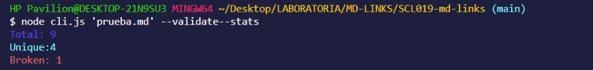

# Markdown Links

## Índice

* [1. ¿Qué es mdlinks?](#1-¿Qué-es-mdlinks?)
* [2. ¿Cómo se utiliza?](#2-¿Cómo-se-utiliza?)
* [3. Cómo se pensó mdlinks](#3-Cómo-se-pensó-mdlinks)
* [4. Desafíos personales enfrentados en el proyecto](#4-Desafíos-personales-enfrentados-en-el-proyecto)

***

## 1. ¿Qué es mdlinks?

Los archivos `Markdown` normalmente contienen _links_ (vínculos/ligas) que
muchas veces están rotos o ya no son válidos y eso perjudica mucho el valor de
la información que se quiere compartir.

Para solucionar esa problemática, fue creada mdlinks, la cual es una herramienta de Línea de comando(CLI), creada en Javascript usando [Node.js](https://nodejs.org/, que lee y analiza archivos en formato `Markdown`, con el fin de verificar los links que contiene el archivo y reportar algunas estadísticas.

## 2. ¿Cómo se utiliza?
* Puedes instalar el módulo desde mi repositorio en github via 

`npm install --global <github-FranciscaValdes>/md-links`

Los comandos que ingreses dependerán de las verificaciones y estadísticas que desees obtener:

1.-Para ver un listado con los links y sus propiedades:
   
   node cli.js 'tu ruta a tu archivo .md'

2.-Para averiguar si el link funciona o no:

   node cli.js 'tu ruta a tu archivo .md' --validate

3.-Para ver de forma simple el total de links y los links únicos:

   node cli.js 'tu ruta a tu archivo .md' --stats

4.-Para conocer el total de links, links únicos y links rotos:

   node cli.js 'tu ruta a tu archivo .md' --validate--stats

## 3. Cómo se pensó mdlinks

Por parte del developer:

1.-	Developer necesita encontrar links rotos, buenos y repertidos en su archivo md
2.-	Instala npm install --global <github-FranciscaValdes>/md-links
3.-	 Ejecutar (md-links <path-to-file> [options])
4.-	$ md-links ./some/example.md Ejecuta el programa y entrega el archivo a revisar
5.-	Se imprime en consola la ruta y los links encontrados.

Por parte del programa

***Programa debe estar disponible para ser instalado a través de npm install
(Configurar package.json, repo público)***
1.- pásame una ruta
2.- Ruta/ archivo: es válido? 
Si: se continúa  / No: lanzar error: “Archivo/ Ruta no válidos”
3.- Ruta:  Absoluta  ||  Relativa
4.- Buscar archivo md válido para leer / si no lo encuentra, lanzar error: “No se ha encontrado archivo formato .md, verificar formato”
5.- Analizar archivo md y encontrar links.
6.- Retornar una promesa que resuelva un arreglo de objetos:
-Cada objeto representa un link y contiene las sgtes. Propiedades: 
Con validate:false :
•	href: URL encontrada.
•	text: Texto que aparecía dentro del link (<a>).
•	file: Ruta del archivo donde se encontró el link.
Con validate:true :
•	href: URL encontrada.
•	text: Texto que aparecía dentro del link (<a>).
•	file: Ruta del archivo donde se encontró el link.
•	status: Código de respuesta HTTP.
•	ok: Mensaje fail en caso de fallo u ok en caso de éxito.
. Imprimirlos en consola.

## 4. Desafíos personales enfrentados en el proyecto

Éste fue mi cuarto proyecto realizado en la generación SCL019 del bootcamp de Laboratoria, fue un tremendo desafío al principio, porque generó para mí un cambio total de escenario:

* 1°: Se debía resolver de manera individual (los dos proyectos anteriores habían sido trabajados con una y dos compañeras más)

* 2°: No se utilizaba html, ni css; nos alejamos completamente del navegador para adentrarnos en una forma de crear un programa de una forma un poco más abstracta.

Al principio todo fue un caos, tuve que leer el readme del proyecto muchas veces para ir adentrandome de a poco en cómo resolverlo. Finalmente mdLinks se transformó en uno de mis proyectos favoritos realizados en el bootcamp!

El gran aprendizaje que me dejó éste proyecto es que en equipo se avanza mejor y más rápido (aprendí ésto porque no tuve equipo, pero sí pedí ayuda a mis compañeras, lo cual me ayudó a poder ir entendiendo mejor lo que debía hacer y finalmente poder resolverlo).

